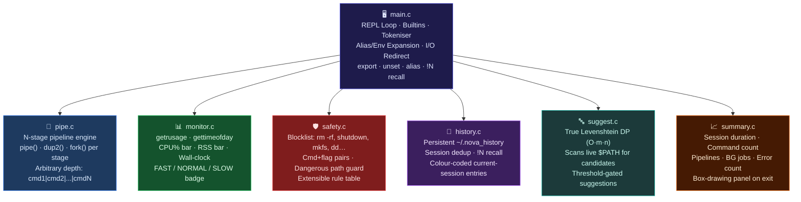

<div align="center">

# 🌌 nova-shell

### *Building from scratch what every developer takes for granted.*

> A fully-featured Unix shell implemented in **C99** — spanning 7 battle-hardened modules. From raw `fork()`/`execvp()` process spawning to real-time CPU+memory telemetry, true Levenshtein-powered typo correction, N-stage pipelines, persistent history, and a safety lockdown that stops catastrophic commands dead in their tracks.

<br/>

[](https://en.wikipedia.org/wiki/C99)
[](https://www.gnu.org/software/make/)
[](https://en.wikipedia.org/wiki/Unix)
[](https://gcc.gnu.org/)
[](https://port70.net/~nsz/c/c99/n1256.html)
[](LICENSE)

<br/>

[⚡ Quick Start](#-quick-start) · [🏗️ Architecture](#-architecture) · [✨ Features](#-features) · [🔬 OS Internals](#-os-internals-deep-dive) · [🛡️ Safety](#-safety-lockdown) · [📊 Telemetry](#-real-time-telemetry) · [👤 Author](#-author)

</div>

---

## 💡 The Premise

Every time you type a command into your terminal, a sophisticated chain of OS primitives fires beneath the surface — `fork()`, `execvp()`, `pipe()`, `dup2()`, `waitpid()`. Most developers use shells every day without a second thought about what's actually happening.

**nova-shell** is a complete reimplementation of that chain, written in pure C99 from a blank `.c` file. No shell libraries. No shortcuts. Every process you spawn, every pipe you thread, every environment variable you expand — nova-shell does it the hard way, the right way.

This isn't a toy REPL. This is a **systems programming showcase**: 7 focused modules, real OS syscalls, a full Levenshtein typo engine scanning `$PATH`, live resource tracking, persistent history, and a safety net that intercepts the commands that can brick a machine.

---

## 🏗️ Architecture

nova-shell decomposes into 7 purposeful modules, each owning a single OS-level concern:



| Module | File | Responsibility | Key Syscalls / Algorithms |
|---|---|---|---|
| **Shell Core** | `main.c` | REPL, builtins, tokeniser, alias, env, redirect | `fork` `execvp` `waitpid` `chdir` `dup2` `open` |
| **Pipe Engine** | `pipe.c` | Arbitrary-depth multi-stage pipelines | `pipe` `dup2` `fork` `close` `waitpid` |
| **Monitor** | `monitor.c` | Real-time CPU + RSS telemetry bars | `getrusage` `gettimeofday` |
| **Safety** | `safety.c` | Destructive command interception | Pattern table, cmd+flag pairs, path guard |
| **History** | `history.c` | Persistent cross-session command log | File I/O, ring buffer, `!N` recall |
| **Suggest** | `suggest.c` | Levenshtein typo engine over live `$PATH` | DP edit-distance, `opendir` `readdir` |
| **Summary** | `summary.c` | End-of-session analytics panel | Wall-clock, aggregation, box-drawing |

---

## ✨ Features

### 🔁 Process Spawning — `fork()` / `execvp()`

Every external command is a full POSIX process. nova-shell forks a child, lets `execvp` replace its image, and waits with `waitpid` — exactly as a production shell does. `SIGCHLD` is handled to auto-reap background zombies.

```
nova [~]> ls -la
total 96
drwxr-xr-x  9 om staff  288 Sep 20 16:00 .
-rw-r--r--  1 om staff 3201 Sep 20 15:55 main.c
...

  ┌─ telemetry
  │ time   0.003s
  │ cpu    [████░░░░░░░░░░░░░░░░]   8.1%
  │ mem    [█░░░░░░░░░░░░░░░░░░░]   0.8 MB
  └─ ⚡ FAST
```

---

### 🔗 N-Stage Pipelines — `cmd1 | cmd2 | cmd3 | ...`

Arbitrary-depth pipelines — not just two commands. The engine allocates N-1 pipe pairs, forks N children, wires each child's stdin/stdout via `dup2`, and waits for all to complete. All file descriptors are correctly closed in every fork.

```
nova [~]> cat /etc/hosts | grep local | awk '{print $2}' | sort -u
broadcasthost
localhost
```

---

### 📂 I/O Redirection — `>`, `>>`, `<`

```
nova [~]> echo "Session started" > log.txt
nova [~]> date >> log.txt
nova [~]> cat < log.txt
Session started
Sun Sep 20 17:00:01 IST 2026
```

---

### 📦 New Built-in Commands

| Command | Description |
|---|---|
| `export VAR=VALUE` | Set and export an environment variable |
| `unset VAR` | Remove an environment variable |
| `alias name=cmd` | Define a command alias |
| `unalias name` | Remove an alias |
| `alias` | List all defined aliases |
| `!N` | Re-execute history entry N |
| `history` | Show full session + previous-session history |
| `cd -` | Toggle to previous directory |
| `help` | Built-in command reference |
| `exit` | Save history + print summary and exit |

```
nova [~]> alias ll='ls -la --color=auto'
nova [~]> ll
# runs: ls -la --color=auto

nova [~]> export EDITOR=vim
nova [~]> echo $EDITOR
vim

nova [~]> !3
# re-executes history entry 3
```

---

### ⚙️ Background Jobs — `command &`

`SIGCHLD` is installed in the shell's main process to auto-reap background children — no zombie accumulation.

```
nova [~]> sleep 10 &
[+] Background PID 84712

nova [~]> echo "I didn't wait"
I didn't wait
```

---

### 🔤 True Levenshtein Typo Suggestions

The old version just checked if the first letter matched. The new engine:
1. Walks every directory in `$PATH` via `opendir`/`readdir` to collect live candidates
2. Computes full **dynamic-programming edit distance** for each candidate
3. Suggests the closest match within a configurable threshold

```
nova [~]> histroy
nova: histroy: command not found
💡 Did you mean: history?  (edit distance: 2)

nova [~]> grpe "fork" main.c
nova: grpe: command not found
💡 Did you mean: grep?  (edit distance: 1)
```

---

### 🛡️ Safety Lockdown

```
nova [~]> rm -rf /
🚨 SAFETY LOCKDOWN: 'rm -rf' is blocked — this flag combination is catastrophically destructive.

nova [~]> shutdown -h now
🚨 SAFETY LOCKDOWN: 'shutdown' is blocked — nova-shell will not execute it.

nova [~]> dd if=/dev/random of=/dev/sda
🚨 SAFETY LOCKDOWN: 'dd' is blocked — nova-shell will not execute it.
```

**Blocked commands:** `shutdown` `reboot` `halt` `poweroff` `init` `mkfs` `fdisk` `dd`  
**Blocked flag pairs:** `rm -rf` `rm -fr` `chmod 777`  
**Blocked rm targets:** `/` `/*` `~` `~/*`

---

### 📊 Real-Time Telemetry

```
  ┌─ telemetry
  │ time   1.243s
  │ cpu    [████████████████░░░░]  78.4%
  │ mem    [███░░░░░░░░░░░░░░░░░]  18.7 MB
  └─ 🐢 SLOW
  ⚠  Resource hog detected — consider background execution (&)
```

| Badge | Threshold |
|---|---|
| ⚡ FAST | < 100ms |
| 🟡 NORMAL | 100ms – 1s |
| 🐢 SLOW | > 1s |

---

### 📜 Persistent History

History loads from `~/.nova_history` on startup and appends new entries on exit. Current-session entries are highlighted in green; previous-session entries appear dimmed.

```
nova [~]> history
  #   Command
  ─────────────────────────────────────
   1  ls -la              ← previous session (dimmed)
   2  cd ~/projects       ← previous session
   3  make release        ← this session (green)
   4  ./build/nova-shell  ← this session
```

---

### 📈 Session Summary

```
  ╔══════════════════════════════════════╗
  ║     nova-shell  session  summary     ║
  ╠══════════════════════════════════════╣
  ║  Commands executed      24           ║
  ║  Pipelines run           3           ║
  ║  Background jobs         1           ║
  ║  Not-found errors        0           ║
  ║  Session duration   00:04:37         ║
  ╚══════════════════════════════════════╝
  Thanks for using nova-shell. See you next time!
```

---

## 🔬 OS Internals Deep Dive

<details>
<summary><strong>🍴 fork() / execvp() — How processes are born</strong></summary>

```c
pid_t pid = fork();
if (pid == 0) {
    signal(SIGINT, SIG_DFL);   /* restore Ctrl-C in child */
    execvp(argv[0], argv);
    fprintf(stderr, "nova: %s: command not found\n", argv[0]);
    exit(127);
} else {
    waitpid(pid, &status, 0);
}
```

`fork()` duplicates the entire process. `execvp()` replaces the child's image with the target binary, searching `$PATH` automatically. The parent blocks in `waitpid` until the child exits.

</details>

<details>
<summary><strong>🔗 pipe() + dup2() — Wiring stdout to stdin for N stages</strong></summary>

```c
int fds[N-1][2];
for (int p = 0; p < n_pipes; p++) pipe(fds[p]);

for (int s = 0; s < n_cmds; s++) {
    if (fork() == 0) {
        if (s > 0)        dup2(fds[s-1][0], STDIN_FILENO);
        if (s < n_cmds-1) dup2(fds[s][1],   STDOUT_FILENO);
        /* close all pipe fds */
        execvp(cmds[s][0], cmds[s]);
    }
}
/* parent closes all fds and waits for all children */
```

Each stage's stdout connects to the next stage's stdin through a kernel pipe buffer. All unused fd copies are closed to prevent deadlocks.

</details>

<details>
<summary><strong>📂 open() + dup2() — I/O Redirection</strong></summary>

```c
/* Output redirect: cmd > file */
int fd = open("output.txt", O_CREAT | O_WRONLY | O_TRUNC, 0644);
dup2(fd, STDOUT_FILENO);  /* fd 1 now writes to file */
close(fd);
execvp(argv[0], argv);
```

`dup2(src, dst)` makes `dst` a copy of `src`. After `dup2(fd, 1)`, file descriptor 1 (stdout) writes to the file — `execvp`'d process inherits this automatically.

</details>

<details>
<summary><strong>📊 getrusage() + gettimeofday() — Resource Telemetry</strong></summary>

```c
struct timeval start, end;
gettimeofday(&start, NULL);
// fork + waitpid
gettimeofday(&end, NULL);
double elapsed = (end.tv_sec - start.tv_sec)
               + (end.tv_usec - start.tv_usec) / 1e6;

struct rusage ru;
getrusage(RUSAGE_CHILDREN, &ru);
/* ru.ru_maxrss: peak RSS in bytes (macOS) or KB (Linux) */
```

</details>

<details>
<summary><strong>🔤 Levenshtein Edit Distance — Full DP</strong></summary>

```c
/* O(m·n) DP with O(min(m,n)) rolling-row space */
int *row = malloc((lb + 1) * sizeof(int));
for (int j = 0; j <= lb; j++) row[j] = j;
for (int i = 1; i <= la; i++) {
    int prev = i;
    for (int j = 1; j <= lb; j++) {
        int cost = (a[i-1] == b[j-1]) ? 0 : 1;
        int val  = min3(row[j-1]+cost, row[j]+1, prev+1);
        row[j-1] = prev;
        prev = val;
    }
    row[lb] = prev;
}
```

Scans every binary in every `$PATH` directory to find the closest real command — not a hardcoded list.

</details>

---

## 🧬 Syscall Reference

| Syscall / API | Module | Purpose |
|---|---|---|
| `fork()` | `main.c`, `pipe.c` | Spawn child process |
| `execvp()` | `main.c`, `pipe.c` | Replace child image with command binary |
| `waitpid()` | `main.c`, `pipe.c` | Reap child, prevent zombies |
| `pipe()` | `pipe.c` | Create anonymous kernel pipe |
| `dup2()` | `main.c`, `pipe.c` | Clone fd onto stdin/stdout/stderr |
| `open()` | `main.c` | Open file for I/O redirection |
| `getrusage()` | `monitor.c` | Peak RSS + CPU time of children |
| `gettimeofday()` | `monitor.c` | Microsecond wall-clock timing |
| `chdir()` | `main.c` | Implement `cd` builtin |
| `setenv()` / `unsetenv()` | `main.c` | Implement `export` / `unset` |
| `opendir()` / `readdir()` | `suggest.c` | Scan `$PATH` for command candidates |
| `signal()` | `main.c` | `SIGINT` ignore in shell, `SIGCHLD` auto-reap |

---

## ⚡ Quick Start

```bash
git clone https://github.com/IronLad123/nova-shell.git
cd nova-shell
make                    # release build (-O2)
./build/nova-shell
```

```bash
make debug              # debug build (ASan + UBSan)
./build/nova-shell-debug
```

```bash
make clean              # remove build artifacts
```

---

## 🛠️ Tech Stack


---

## 👤 Author

<div align="center">

**Om Srivastava**  
*B.Tech CSE (Data Science) · VIT Chennai*

[](https://github.com/IronLad123)
[](https://linkedin.com/in/om-srivastava-6717b7277)

</div>

---

<div align="center">

*nova-shell — because understanding your tools means building them yourself.*

⭐ **Star this repo if you respect the craft.**

</div>
